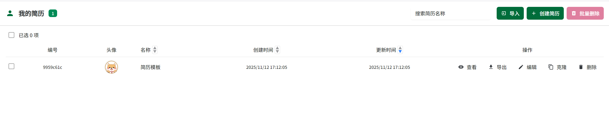
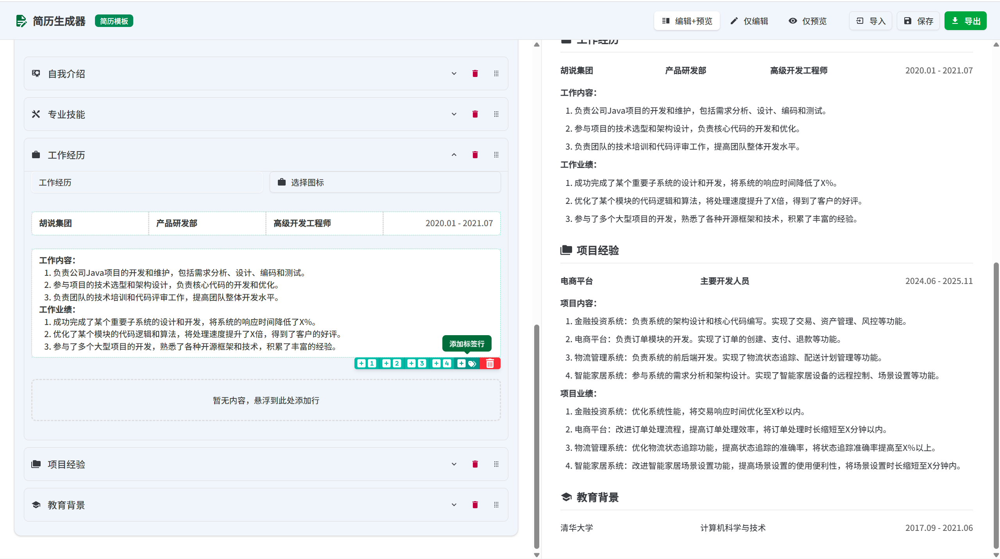
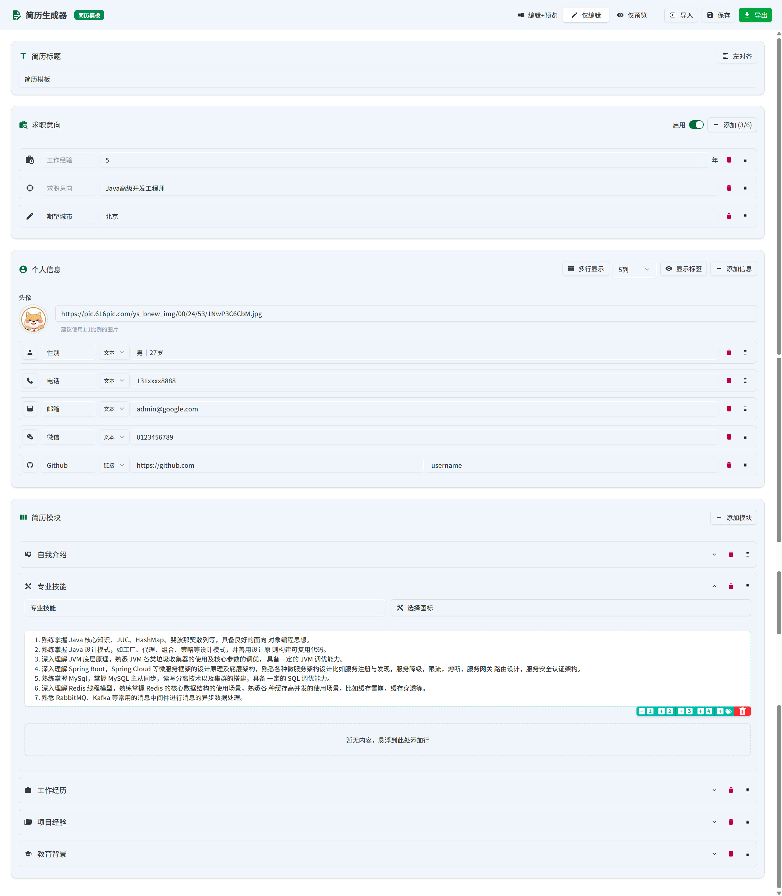
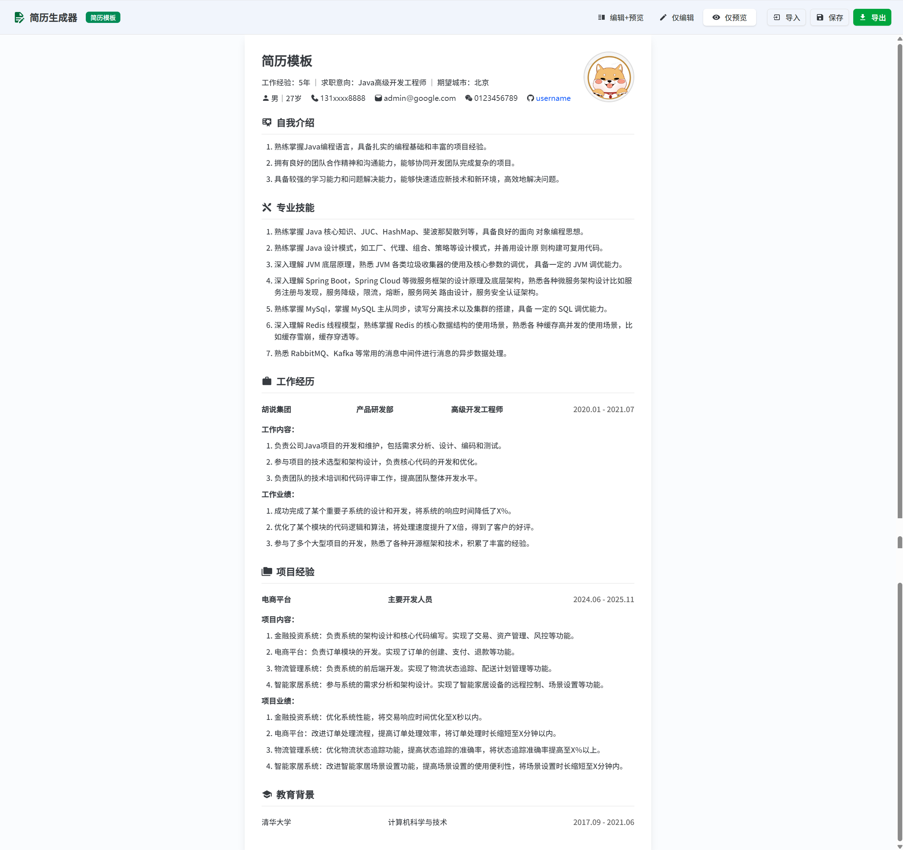
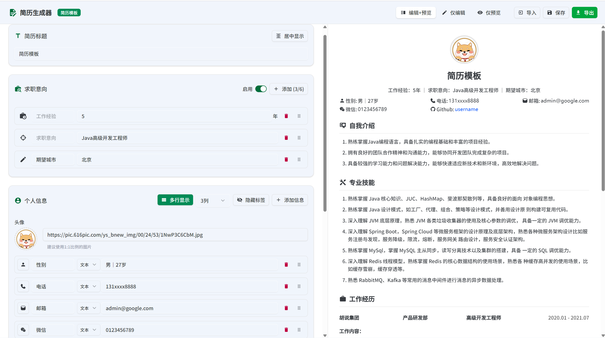
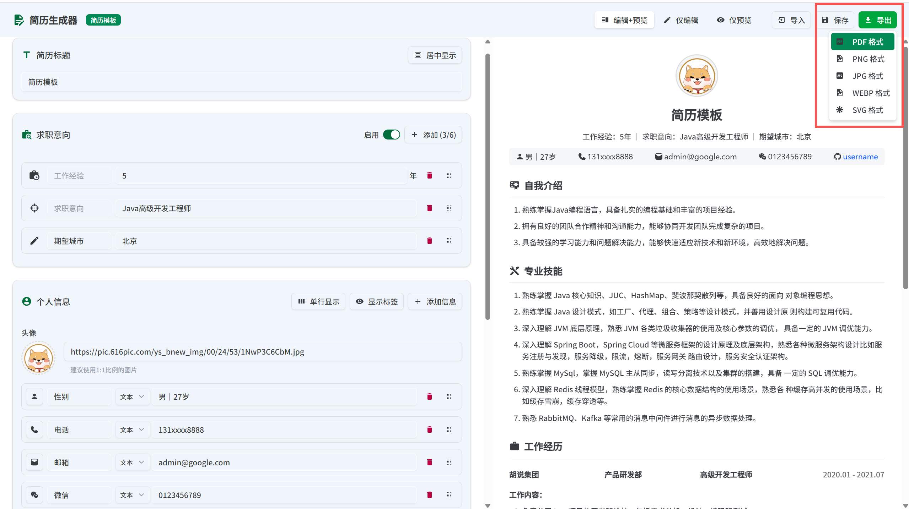
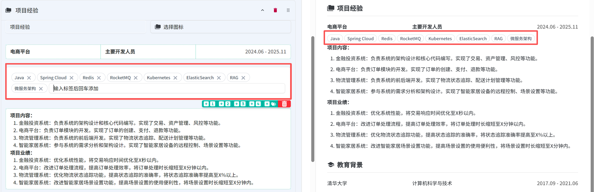

# 简历生成器

> 基于 [resume-builder](https://github.com/magicyan418/resume-builder) 二次开发，感谢原作者的开源。

一个支持本地多简历管理、所见即所得编辑、AI 优化和多格式导出的简历生成工具。项目默认把简历保存在浏览器本地，适合维护多份岗位定制简历，也适合部署成一个轻量的私有简历编辑器。

<p align="left">
  <a href="https://vercel.com/new/clone?repository-url=https%3A%2F%2Fgithub.com%2Fwzdnzd%2Fresume&env=SITE_PASSWORD&project-name=resume&repository-name=resume" target="_blank" rel="noopener noreferrer"></a>
  &nbsp;
  <a href="https://edgeone.ai/pages/new?repository-url=https%3A%2F%2Fgithub.com%2Fwzdnzd%2Fresume&env=SITE_PASSWORD&project-name=resume&repository-name=resume" target="_blank" rel="noopener noreferrer"></a>
</p>

## 适合用来做什么

- 管理多份不同岗位、不同版本的简历。
- 在浏览器里完成简历编辑、预览、保存和导出。
- 根据目标岗位 JD 分析简历匹配度，并生成优化建议。
- 为专业技能、工作经历、项目经历生成候选内容。
- 将简历导出为 PDF、图片或 JSON 备份文件。
- 部署为私有工具，并通过访问密码做简单保护。

## 功能概览

- **用户中心**：首页集中管理所有本地简历，支持搜索、排序、查看、编辑、克隆、删除、批量删除、导入和导出。
- **本地存储**：简历保存在浏览器 `localStorage` 中，不依赖账号和数据库；重要简历可导出 JSON 备份。
- **实时编辑预览**：支持“编辑+预览”“仅编辑”“仅预览”三种模式，修改内容后可即时查看排版效果。
- **个人信息编辑**：支持头像、电话、邮箱、链接、图标、标签显隐、头像形状、单行/网格布局和拖拽排序。
- **求职意向编辑**：支持工作经验、目标岗位、目标城市、期望薪资和自定义字段，可启用/关闭并调整顺序。
- **模块化内容**：可自由创建教育背景、工作经历、项目经历、专业技能等模块，支持模块图标、模块排序、1-4 列内容行和标签行。
- **富文本排版**：支持字体、字号、颜色、加粗、斜体、下划线、链接、代码、列表、对齐和清除格式。
- **AI 简历助手**：支持 JD 匹配度分析、现有内容优化、候选内容生成和全文纠错。
- **模块级 AI 对话**：每个模块都可以单独打开 AI 对话，根据当前模块内容生成或改写草稿，并一键应用。
- **多格式导出**：支持 PDF、JSON、PNG、JPG、WEBP、SVG。
- **服务端 PDF 优先**：优先使用服务端 Chromium 生成干净 PDF；不可用时自动切换到浏览器打印，并给出清晰提示。
- **访问密码保护**：可通过环境变量开启页面访问密码，适合私有部署。

## 页面示例截图

1. 用户中心：本地化集中管理多份简历


2. 编辑和预览：随时查看渲染效果


3. 仅编辑：专注于编写


4. 仅预览：简历效果一览无余


5. 自由布局：左对齐/居中对齐、列数调整等多个选项随心控制


6. 多种导出方式：不同成品满足不同需求


7. 标签功能：为企业、项目或技能添加标签，让 HR/面试官快速理解重点


## 快速开始

建议使用 Node.js 20+ 和 pnpm。

```bash
pnpm install
pnpm dev
```

开发服务启动后访问 [http://localhost:3000](http://localhost:3000)。

生产构建：

```bash
pnpm build
pnpm start
```

## 使用流程

1. 进入首页，点击“创建简历”新建默认简历，或点击“示例”打开示例模板。
2. 在编辑页填写标题、求职意向、个人信息和简历模块。
3. 使用视图切换在编辑和预览之间调整工作方式。
4. 点击“保存”后，简历会保存到当前浏览器本地。
5. 点击“导出”输出 PDF、图片或 JSON 文件。
6. 如需创建岗位定制版本，可在用户中心克隆已有简历后再单独修改。

## 功能详解

### 用户中心

用户中心是首页，也是简历管理入口。它会展示当前浏览器中保存的所有简历，并提供常用操作：

- 新建简历
- 导入 JSON 简历文件
- 查看简历
- 编辑简历
- 克隆简历
- 导出简历
- 删除单份或批量删除简历
- 按名称、创建时间、更新时间排序
- 按简历名称搜索

当浏览器本地存储空间不足时，系统会提示先导出 JSON 做备份，再清理旧简历。

### 简历编辑器

编辑器由左侧编辑区域和右侧预览区域组成，也可以切换为仅编辑或仅预览。顶部工具栏提供返回、视图切换、AI 优化、保存和导出入口。

简历标题支持左对齐或居中显示。居中模式下头像会显示在标题上方；左对齐模式下头像显示在右侧，并自动和头部信息区域保持协调高度。

### 个人信息

个人信息模块适合填写姓名相关的基础信息，例如电话、邮箱、所在地、个人网站、GitHub、作品集等。

支持能力：

- 上传头像或填写头像 URL。
- 头像可选择圆形或方形。
- 信息项可选择图标。
- 信息项支持文本或链接。
- 链接可设置展示标题。
- 可隐藏或显示字段标签。
- 可在单行紧凑布局和多行网格布局之间切换。
- 网格布局可设置每行展示数量。
- 信息项支持拖拽排序。

### 求职意向

求职意向模块可选择开启或关闭。内置字段包括：

- 工作经验
- 求职意向
- 目标城市
- 期望薪资
- 自定义字段

期望薪资支持填写最低值和最高值，会自动展示为类似 `12K - 18K`、`12K 起`、`18K 以下` 的格式。求职意向项最多 6 个，可拖拽调整顺序。

### 简历模块

简历正文采用模块化设计。你可以创建任意模块，例如：

- 教育背景
- 工作经历
- 项目经历
- 专业技能
- 个人总结
- 荣誉奖项
- 证书经历
- 开源项目

每个模块支持：

- 修改模块标题。
- 选择模块图标。
- 删除模块。
- 拖拽调整模块顺序。
- 添加 1 列、2 列、3 列或 4 列内容行。
- 添加标签行。
- 删除内容行。
- 对单个模块使用 AI 对话生成草稿。

多列内容行适合展示学校/专业/时间、公司/岗位/时间、项目名称/角色/周期等结构化信息。标签行适合展示技能栈、关键词、工具和能力标签。

### 富文本编辑

正文内容使用富文本编辑器，可以细致控制每个内容块的排版。

支持格式：

- 字体
- 字号
- 文字颜色
- 加粗
- 斜体
- 下划线
- 行内代码
- 链接
- 左对齐、居中、右对齐、两端对齐
- 无序列表
- 有序列表
- 清除格式

富文本内容会同步用于页面预览、图片导出和 PDF 导出，尽量保持所见即所得。

## AI 功能

AI 功能需要配置服务商 API Key。当前支持 OpenAI、Anthropic、Gemini，以及兼容 OpenAI Chat Completions 格式的第三方服务。

### 整份简历 AI 助手

编辑器顶部的“AI 优化”会打开整份简历助手。它围绕目标岗位 JD 工作，适合做岗位定制简历。

支持三类主要操作：

- **分析匹配度**：分析当前简历和目标岗位 JD 的匹配情况，给出匹配度、已匹配关键词、缺失关键词和改进方向。
- **优化现有内容**：基于当前简历已有内容生成可应用建议，例如润色项目经历、强化技能表达、纠正错别字。
- **生成候选内容**：基于目标岗位、JD 和用户补充信息，为专业技能、工作经历、项目经历生成候选草稿。

AI 建议不会自动覆盖简历。用户可以逐条查看“当前内容”和“候选优化”，再选择复制、忽略或应用。

### 候选内容生成

候选内容生成适合简历还没完全写好的场景。它会根据 JD 和用户补充信息生成草稿，并在缺少事实时保留醒目的待补充提示，避免凭空编造经历。

建议使用方式：

- 填写目标岗位名称。
- 粘贴完整 Job Description。
- 在用户补充信息中写清真实经历、项目、职责、技术栈和可公开指标。
- 确认候选内容后再应用到模块。

### 模块级 AI 对话

每个简历模块标题右侧都有 AI 对话入口。它只处理当前模块，适合小范围生成或改写：

- 让 AI 根据已有项目经历润色表达。
- 让 AI 把零散经历整理成多列简历行。
- 让 AI 为专业技能生成标签行。
- 让 AI 根据教育背景或工作经历补齐结构化描述。

关闭模块 AI 窗口后，本轮对话上下文会清空，避免不同模块之间互相污染。

## 导出功能

### PDF 导出

PDF 导出优先使用服务端 Chromium 渲染，这样可以获得更稳定的 A4 页面和更干净的 PDF 文件。服务端不可用时，会自动切换到浏览器打印模式。

浏览器打印模式下，请在打印对话框中：

- 关闭“页眉和页脚”。
- 勾选“背景图形”。
- 选择“保存为 PDF”。

### 图片导出

支持导出：

- PNG
- JPG
- WEBP
- SVG

图片导出会尽量使用当前预览区域；如果当前页面没有预览区域，会临时渲染离屏预览再导出。远程图片会通过同源代理处理，降低跨域导致导出失败的概率。

### JSON 导入导出

JSON 是简历数据备份格式。它适合：

- 迁移到另一个浏览器。
- 备份重要简历。
- 清理浏览器存储前先保存数据。
- 在部署地址变化后重新导入简历。

用户中心和编辑页都可以导出 JSON；用户中心支持导入 JSON。

## 数据与隐私

- 简历默认保存在当前浏览器本地，不会自动上传到远程数据库。
- AI 功能开启后，目标岗位 JD、当前简历摘要和用户补充信息会发送给你配置的 AI 服务商。
- API Key 只在服务端读取，不会作为前端环境变量暴露。
- 访问密码保护只提供轻量页面级保护，适合个人部署或小范围分享。

## 配置说明

项目根目录提供 `.env.example`。如需使用 AI 功能，可创建 `.env.local`：

```bash
AI_PROVIDER=openai
AI_BASE_URL=https://api.openai.com/v1
AI_API_KEY=你的 API Key
AI_MODEL=gpt-4o-mini
```

不同服务商示例：

```bash
# OpenAI 或 OpenAI 兼容服务
AI_PROVIDER=openai
AI_BASE_URL=https://api.openai.com/v1
AI_MODEL=gpt-4o-mini

# Anthropic
AI_PROVIDER=anthropic
AI_BASE_URL=https://api.anthropic.com/v1
AI_MODEL=claude-3-5-haiku-latest

# Gemini
AI_PROVIDER=gemini
AI_BASE_URL=https://generativelanguage.googleapis.com/v1beta
AI_MODEL=gemini-2.5-flash
```

PDF 相关配置：

```bash
NEXT_PUBLIC_FORCE_SERVER_PDF=true  # 强制使用服务端 PDF
NEXT_PUBLIC_FORCE_PRINT=true       # 强制使用浏览器打印
PUPPETEER_EXECUTABLE_PATH=/path/to/chrome
CHROME_PATH=/path/to/chrome
```

访问密码：

```bash
SITE_PASSWORD=你的访问密码
```

设置后，访问页面会先进入密码页；验证通过后 30 天内无需重复输入。删除或清空 `SITE_PASSWORD` 即可关闭访问保护。

## 常见问题

### 首页没有看到之前保存的简历

简历保存在浏览器本地。请确认使用的是同一个浏览器、同一个域名和协议。浏览器清理站点数据、无痕模式关闭、部署域名变化都会导致本地数据不可见。已经导出的 JSON 文件可以在用户中心重新导入。

### AI 按钮提示配置错误

请检查 `.env.local` 是否配置了 `AI_PROVIDER`、`AI_API_KEY` 和可用模型。修改环境变量后需要重启开发服务。

### AI 返回格式错误

AI 简历优化需要模型稳定返回结构化内容。可以优先尝试更稳定的模型，或检查自定义 OpenAI 兼容服务是否完整支持聊天补全格式。

### PDF 自动切换到浏览器打印

说明当前环境无法启动服务端 Chromium，或 PDF 生成失败。可以通过指定系统 Chrome 路径、增加部署平台函数内存/超时，或直接使用浏览器打印模式解决。

### PDF 下载提示缓存过期

PDF 预览使用短期缓存。缓存过期后，重新点击导出即可生成新的 PDF。

### 图片导出失败或头像缺失

远程头像可能被上游站点阻止访问。可以改用本地上传头像、同源图片或 data URL。

## 技术栈

- **框架**：Next.js、React、TypeScript
- **样式与 UI**：Tailwind CSS、Shadcn UI、Radix UI
- **富文本**：Tiptap
- **拖拽排序**：@hello-pangea/dnd
- **图片导出**：html-to-image
- **PDF 生成**：puppeteer-core、@sparticuz/chromium

## 路线图

### AI 服务

- [x] 支持 OpenAI、Anthropic、Gemini 及 OpenAI 兼容服务配置
- [x] 根据 Job Description 分析匹配度、优化简历、生成候选内容
- [x] 支持单模块 AI 对话式生成与应用
- [ ] 基于简历给出面试准备建议
- [ ] 模拟面试
- [ ] 利用 AI Agent 自动抓取并汇总相似岗位面经

### 简历样式

- [ ] 提供更多简历模板

### 数据同步

- [ ] 集成 WebDAV、Google Drive、OneDrive 等远程存储
- [ ] 支持用户自定义加密密码

## 许可证

MIT
